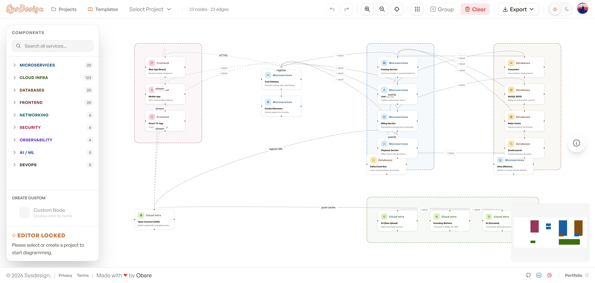
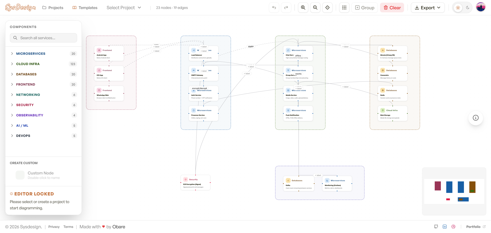
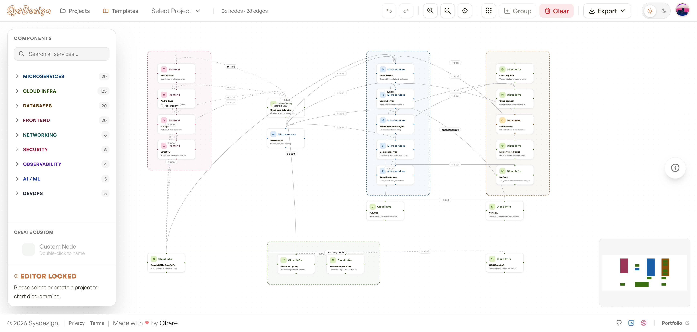

# SysDesign - Professional Systems Architecture Visualizer

SysDesign is a high-performance, web-based tool for designing, visualizing, and documenting complex system architectures. Built with modern web technologies, it provides a seamless drag-and-drop experience for creating professional-grade diagrams.

## Key Features

- **Professional Components**: Pre-built registry of microservices, cloud infra (AWS/GCP/Azure), databases, and more.
- **Smart Connectivity**: Intelligent edge routing and connection management.
- **Project Persistent**: Sync your work to Supabase or keep it private with LocalStorage.
- **Advanced Export**: Export your designs as high-res PNG, SVG, Mermaid notation, or even Terraform boilerplate.
- **AI-Powered (Coming Soon)**: Bring your own API keys to have AI generate and optimize complex system architectures for you.
- **History and Snap**: Full Undo/Redo support and grid snapping for pixel-perfect layouts.
- **Free to Use**: Open-source and free for all developers.
- **Architecture Templates**: Starter guides for world-class systems like Netflix, WhatsApp, and YouTube.

---

## Architecture Templates

SysDesign includes high-fidelity starter templates for several world-class systems. These serve as basic guides and are meant for previewing complex layouts, with many more professional blueprints coming in future updates.

| **Netflix Architecture** | **WhatsApp Messaging** | **YouTube Scale** |
| :---: | :---: | :---: |
|  |  |  |

---

## Technology Stack

- **Core Framework**: [TanStack Start](https://tanstack.com/start) (React 19 + Vite 7)
- **Routing**: [TanStack Router](https://tanstack.com/router) (File-based)
- **State Management**: [TanStack Store](https://tanstack.com/store)
- **Diagramming Engine**: [XYFlow](https://xyflow.com/) (React Flow)
- **Database and Auth**: [Supabase](https://supabase.com/)
- **Styling**: [Tailwind CSS 4](https://tailwindcss.com/) + [Next Themes](https://github.com/pacocoursey/next-themes)
- **Icons**: [Tabler Icons](https://tabler.io/icons) + [Lucide React](https://lucide.dev/)
- **Testing**: [Vitest](https://vitest.dev/) + [React Testing Library](https://testing-library.com/)

---

## Project Structure

```text
src/
├── components/
│   ├── canvas/      # Core diagram engine and custom components (Nodes/Edges)
│   ├── dashboard/   # Project management popups and views
│   ├── export/      # Tools for PNG, SVG, Mermaid, and Terraform generation
│   ├── layout/      # Shared layout components (Footer, Mobile alerts)
│   ├── sidebar/     # Component registry and drag-and-drop interface
│   ├── toolbar/     # Command center (Undo, Snap, Export, Projects)
│   └── ui/          # Atomic UI components and design tokens
├── data/            # Definitions for the component registry (AWS, GCP, etc.)
├── lib/             # Third-party service initializations (Supabase client)
├── routes/          # Application routes (File-based routing)
├── store/           # Global application state (Canvas data, User projects)
├── types/           # Global TypeScript definitions
└── globals.css      # Core design system and Tailwind config
```

---

## Architecture Overview

SysDesign is a modern web application leveraging the TanStack Start framework for high performance and type safety.

### Core Layers

#### Data and API Layers
We use Supabase for:
- **Authentication**: Managing Google Social Login and user sessions.
- **Database (PostgreSQL)**: Storing project metadata, node positions, and edge connections.
- **Realtime (WIP)**: For collaborative editing and state syncing.

#### State Management
We use TanStack Store to manage two main state domains:
- **Project Store (src/store/project.store.ts)**: Handles the list of user projects, current authentication state, and syncing between LocalStorage (for guest users) and Supabase.
- **Canvas Store (src/store/canvas.store.ts)**: Manages the current diagram state (nodes, edges), history stack (undo/redo), and grid snapping.

#### Diagramming Engine
XYFlow (React Flow) is the heart of SysDesign:
- **Custom Nodes (src/components/canvas/DiagramNode.tsx)**: The components which represent microservices, databases, etc.
- **Custom Edges (src/components/canvas/DiagramEdge.tsx)**: Smart routing between components with editable labels.
- **ReactFlowProvider**: All diagram interactions are wrapped in this provider across relevant routes.

#### Export Utilities
We use html-to-image for visual exports (PNG, SVG) and custom serializers for Mermaid and Terraform boilerplate.

### Routing
TanStack Router provides type-safe, file-based routing:
- `/`: Home / Default Editor.
- `/projects`: Project Dashboard.
- `/$slug`: Individual Project Editor.
- `/privacy`, `/terms`: Static legal pages.

---

## Local Setup

### 1. Prerequisites
- Node.js (v18+)
- pnpm (Preferred)

### 2. Follow these steps:

1. **Clone the repository**:
   ```bash
   git clone https://github.com/your-username/sysdesign.git
   cd sysdesign
   ```

2. **Install dependencies**:
   ```bash
   pnpm install
   ```

3. **Configure Environment Variables**:
   Create a `.env` file in the root directory (refer to `.env.example`):
   ```env
   VITE_SUPABASE_URL=https://your-project.supabase.co
   VITE_SUPABASE_ANON_KEY=your-anon-key
   ```

4. **Start the development server**:
   ```bash
   pnpm dev
   ```
   Open http://localhost:3000 in your browser.

---

## Environment Variables and Supabase Setup

SysDesign requires a Supabase project to handle user authentication and cloud persistence.

### Variable Reference

| Variable | Required | Description |
| :--- | :--- | :--- |
| `VITE_SUPABASE_URL` | **Yes** | The API endpoint of your Supabase project (Found in Project Settings > API). |
| `VITE_SUPABASE_ANON_KEY` | **Yes** | The anon / public key for client-side API calls. |

### Database Schema Setup

To support project saving, your Supabase project needs a `projects` table. Use the SQL editor in Supabase to run this:

```sql
create table projects (
  id uuid primary key default uuid_generate_v4(),
  user_id uuid references auth.users not null,
  name text not null,
  slug text not null,
  description text,
  nodes jsonb default '[]'::jsonb,
  edges jsonb default '[]'::jsonb,
  edge_counter int default 0,
  created_at timestamp with time zone default now(),
  updated_at timestamp with time zone default now()
);

-- Enable RLS (Row Level Security)
alter table projects enable row level security;

-- Policy: Users can only see their own projects
create policy "Users can only access their own projects" 
  on projects for all 
  using (auth.uid() = user_id);
```

### Authentication setup

Go to Supabase > Authentication > Providers and enable Google.
You will need to provide your Google OAuth Client ID and Secret obtained from the Google Cloud Console.

---

## Creating Issues

We welcome contributions and bug reports! To create an issue:
1. Navigate to the Issues tab on GitHub.
2. Search for existing issues to avoid duplicates.
3. Use the provided templates for Bug Reports or Feature Requests.
4. Provide as much context as possible (steps to reproduce, environment details).

---

## Road Map (To-Do)

- [ ] **AI-Assisted Design**: Intelligent system generation and layout optimization using a Bring-Your-Own-Key (BYOK) model for LLMs.
- [ ] **Dockerization**: Containerize the app for easier deployment and isolation.
- [ ] **Multi-User Editing**: Enable real-time collaborative diagramming via Supabase Realtime.
- [ ] **Shareable Links**: Generate public read-only URLs for your architecture designs.
- [ ] **Extended Test Suite**: Increase code coverage with comprehensive unit and integration tests.

---

## Contributing

- **TypeScript**: We use strict TypeScript for type safety across all components and stores.
- **Tailwind CSS 4**: Preference for utility classes over custom CSS.
- **ESLint and Prettier**: We follow standard formatting and rules for React and TanStack apps.
- **Components**: Group related components into their own subdirectories within src/components/.

---

## License

Free to use under the MIT License.
